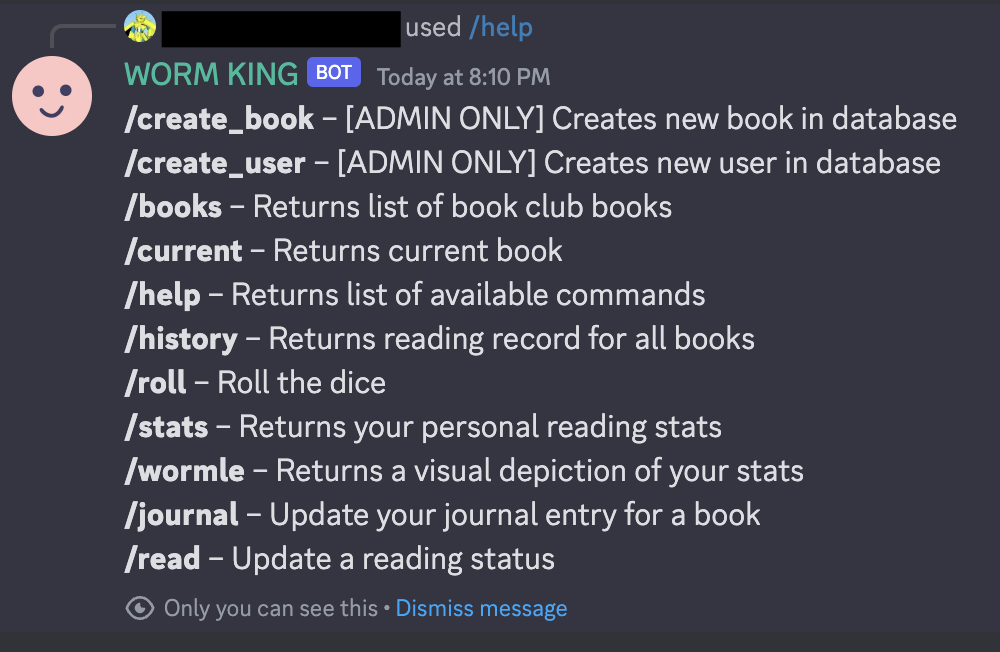
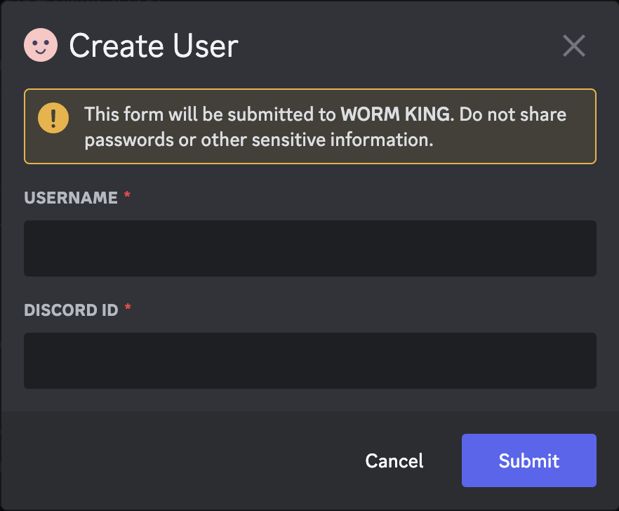
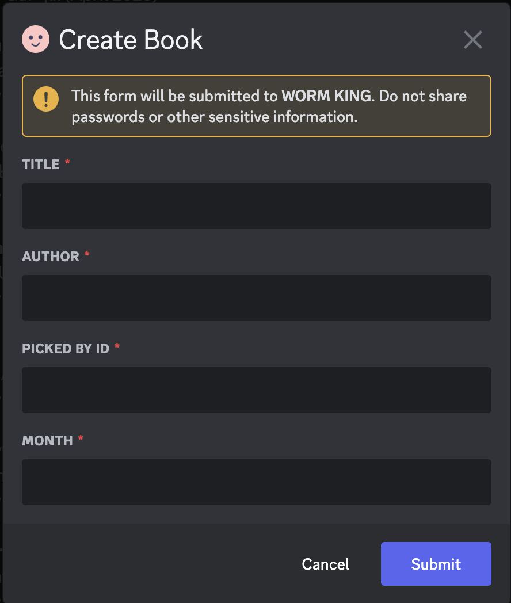
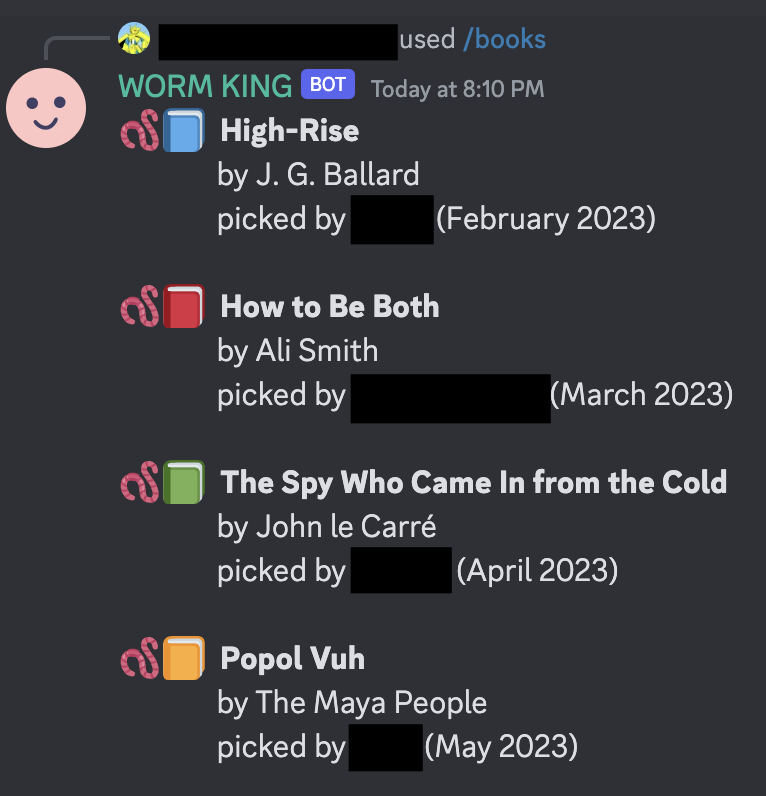
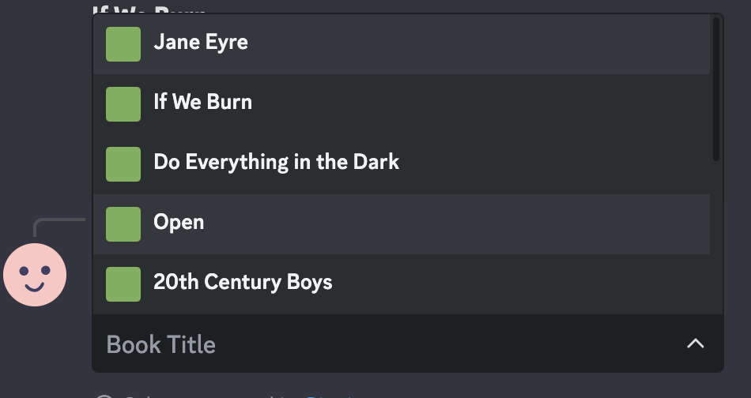
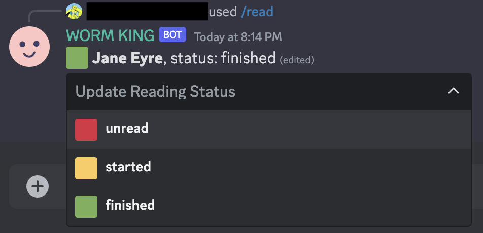
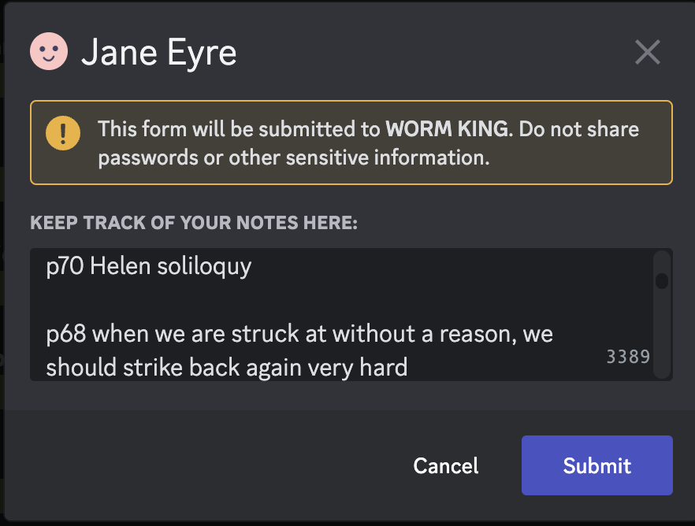
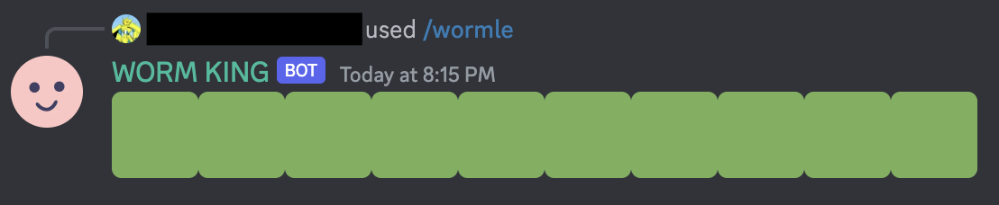
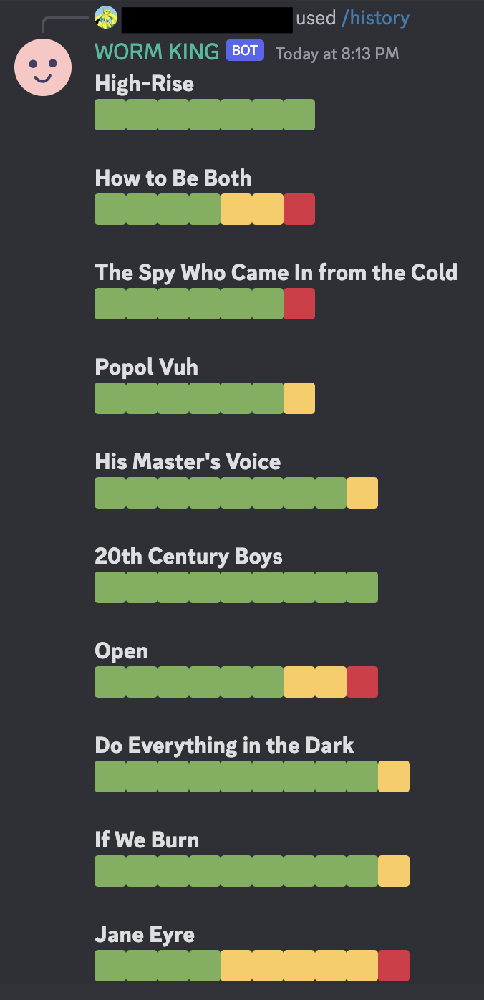

# Worm King

I love to read. A Discord bot for my book club. Built with Node.js, the discord.js library, and MongoDB.

Follow me on [GoodReads](https://www.goodreads.com/user/show/128988061-jeff)...

### Slash Commands

#### /help

Returns list of available commands

#### /create_user

Creates new user in database (admin only)

#### /create_book

Creates new book in database (admin only). Automatically assigns new book as the current book.

#### /books

Returns list of book club books

#### /current

Returns the book we're currently reading

#### /read

Updates your reading status.
- 🟥 Unread
- 🟨 Started
- 🟩 Finished

#### /journal

Keep track of your notes for each book.

#### /stats

Share your personal reading stats.

#### /wormle

Share your personal reading stats in worm form.

#### /history

Returns the stats for your entire book club.

